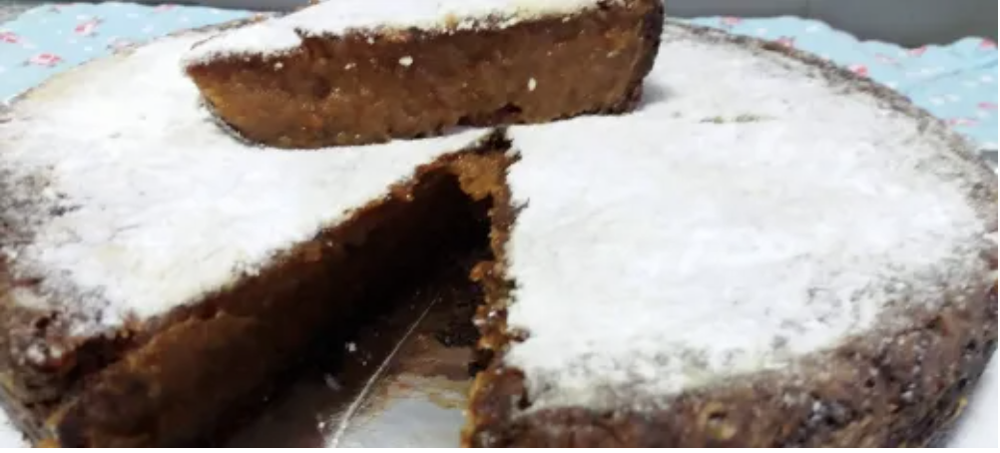

---
hide:
  - navigation
  - toc
  - footer
  - tags
tags:
  - Pudins e outros
---

# Pudim de Feijão Açoriano

 

## **Ingredientes**

* 400g Feijão branco cozido
* 400g Açucar
* 200g Água
* 125g Manteiga
* 1 colher de chá Canela em pó
* 2 colheres de sopa Amido de Milho maizena
* 1 cálice Vinho do Porto
* 6 Gema de Ovo
* 100g Açucar p/ fazer caramelo
* 2 Clara de Ovo
* q.b. Farinha p/ polvilhar
* q.b. Margarina p/ untar

 

## **Preparação**

1. Pré-aquecer o forno a **180ºC**. Unte uma forma de tarte com manteiga e polvilhe com farinha e reserve.
2. No copo coloque o feijão branco cozido e triture até ficar em puré, programando **30 seg/vel 5-7-10** progressivamente. Reservar.
3. No copo limpo, colocar o açúcar, a água e programar 10 min/120ºC/vel 2 (TM31: Varoma).
4. Juntar a manteiga, o puré de feijão reservado, a canela, o amido de milho, o vinho do Porto, as gemas e programar 10 min/120ºC/vel 2 (TM31: Varoma).
5. Derreter no fogão o açúcar até ficar com cor de caramelo (cuidado para não deixar queimar o açúcar porque pode estragar o pudim e fica amargo).
6. Juntar o resultado à massa e misturar uns segundos/vel 4 até ficar bem incorporado. Reservar para uma tigela.
7. No copo limpo insira a borboleta. Coloque as claras e bata 2 min/vel 4.
8. Envolva as claras com o preparado do pudim.
9. Coloque o preparado na forma e leve ao forno a **180ºC** durante **1 hora** aproximadamente.

 
